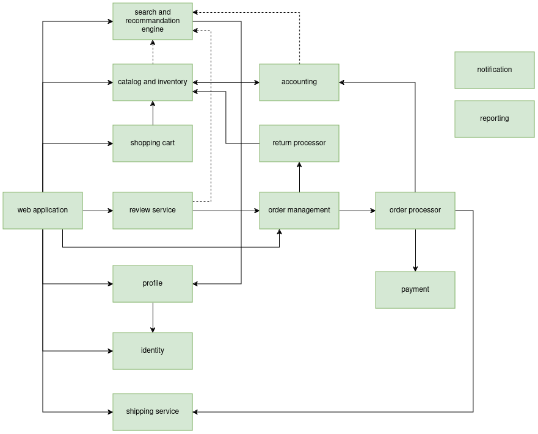
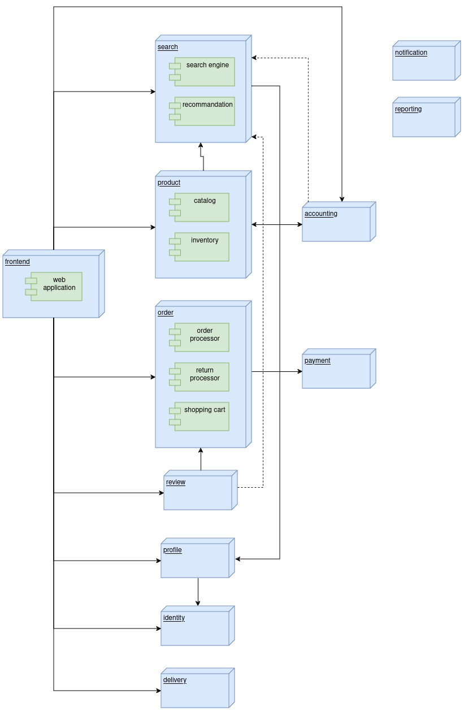

# .github
Web application allowing user to borrow a movie.

# Summary
1- [Architecture document](./docs/architecture_document.md)

# Global architecture (high level)

# Component architecture (low level)

# Workflows
### [User registration](./workflows/user_signup.png)
### [Authenticate user](./workflows/user_signin.png)
### [Add a movie](./workflows/add_movie.png)
### Add a movie to whitelist
### [Add a movie to the cart](./workflows/add_to_shopping_cart.png)
### [Borrowing movie](./workflows/order_processor_movie.png)
### [Return a movie](./workflows/return_movie.png)
### [Delete a movie](./workflows/remove-movie.md)
### Discount code
### Ad campaign
### Suggest a movie
### Delete account
### [Review a movie](./workflows/review_movie.png)
