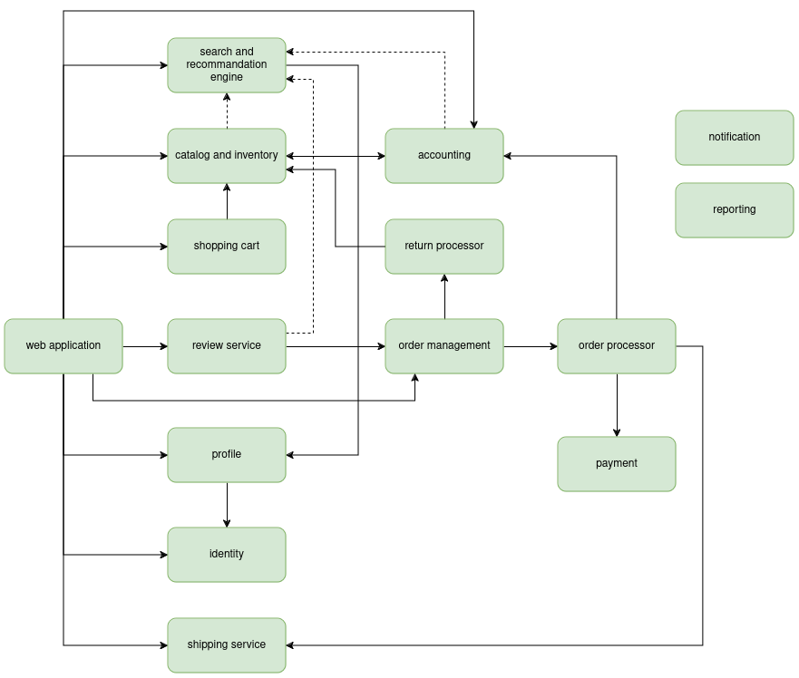
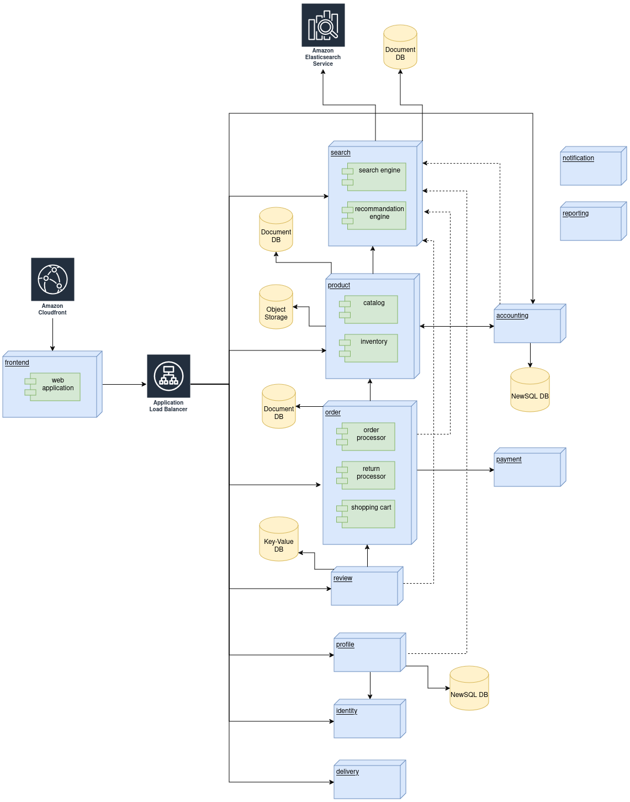

# .github
Web application allowing you to borrow a movie.

# Functional requirements
- Display all movies paginated
- Display catalog base on recommendations (favourites genders, rates ...)
- Search in the movie catalog
- Each user can suggest the addition of new movie
- Each user can rate a film after borrowing, and add some comments
- borrowing and return a movie
- Type of users: visitor, borrower,admin
- Admin user can add a new movie
- Build analytics base on movie and users
- The borrowing price depends on borrowing duration
- Discount code base on movie or specific users
- Penalties for users who fail to return a movie on time
- Notify user when borrowing deadline is being reached
- Only one copy of the movie may be borrowed by the same user
- User can add a movie to whitelist, rate and comment a movie
- rgpd

# Non functional requirements
- Initialize catalog database using [Movielens](https://grouplens.org/datasets/movielens/)
- Expecting 300.000 movies
- Promotional trailier: 50Mb per movie => 15GB
- 1M comments and rating on movies
- 10.000 active users

# Global architecture (high level)

# Component architecture (low level)

# Workflows
### [User registration](./workflows/user_signup.png)
### [Authenticate user](./workflows/user_signin.png)
### [Add a movie](./workflows/add_movie.png)
### Add a movie to whitelist
### [Add a movie to the cart](./workflows/add_to_shopping_cart.png)
### [Borrowing movie](./workflows/order_processor_movie.png)
### [Return a movie](./workflows/return_movie.png)
### [Delete a movie](./workflows/remove-movie.md)
### Discount code
### Ad campaign
### Suggest a movie
### Delete account
### [Review a movie](./workflows/review_movie.png)
