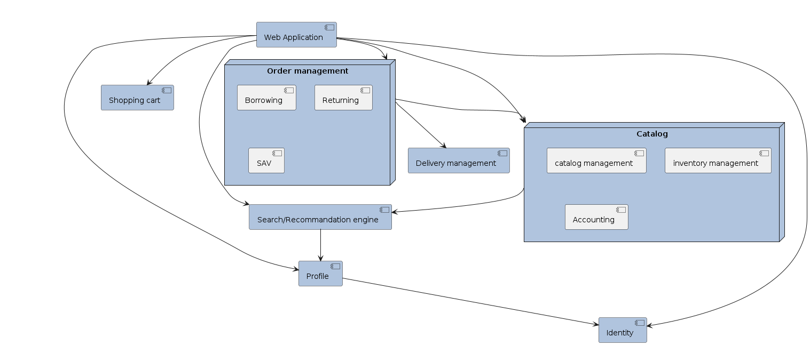

# .github
Web application allowing user to borrow a movie.

# Table of contents
1. [Architecture document](./docs/architecture_document.md)
2. [Getting started](./docs/startup.md)
3. [Contributing guidelines](./CONTRIBUTING.md)

# Global architecture (high level)

# Component architecture (low level)

