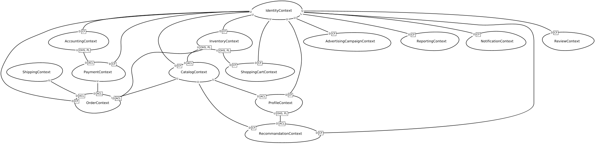
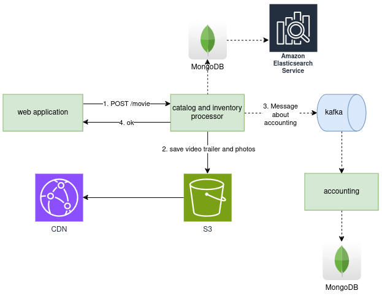

# Architecture document

## Table of contents
1. [Summary](#summary)
2. [Requirements](#requirements)
3. [Domain design](#domain-design)

## Summary
- This document describes the MovieBrains application's architecture
- MovieBrains application help people to borrow blogbuster movie
- The application give informations about the movie's rate, comments, the most watched movie and so on
- A user can browse the movie catalog, view movie details and trailer, borrow a movie for a specific period
- if a visitor is interested by a movie, he has to sign up before ordering the movie

## Requirements
### Functional requirements
- Display all movies using pagination
- Display catalog base on recommendations (favourites genders, rates ...)
- Search in the movie catalog
- Each user can suggest the addition of new movies
- Each user can rate a movie after returning, and add some comments
- borrowing and return a movie
- Admin user can add a new movie
- Build analytics base on movie and users
- The borrowing price depends on borrowing duration
- Discount code base on movie or specific users
- Penalties for users who fail to return a movie on time
- Notify user when borrowing deadline is being reached
- Only one copy of the movie may be borrowed by the same user
- rgpd

### Non functional requirements
- Initialize catalog database using [Movielens](https://grouplens.org/datasets/movielens/)
- Expecting 300.000 movies
- Promotional trailier: 50Mb per movie => 15GB
- 1M comments and rating on movies
- 10.000 active users

### Users
- Platform administrator
- connected user
- visitor

## Domain design
### Domains and sub domains
- **Business domain:** Borrowing movies
- **Core subdomains:** movie's catalog, inventory, order, exclusivity contract, movie analytics, recommendation engine, web application, accounting
- **Generic subdomains:** shipping, payment
- **Support subdomains:** ad campaigns, discount, notification, security/confidentialité, social networks integration, movie streaming services integration, reporting, wishlist, profile, shopping cart, review (rate, comments, reactions)

### Context description
- **Catalog**: Add, modfy or remove a movie from the catalog
- **Inventory**: Inventory management of movies, increase and decrease the number of copies of a movie
- **Accounting**: Context of managing the price of each movie
- **Recommandation engine**: engine used to recommand movie to a user, based on multiples parameters
- **Web Application**: Web application used by clients to browse the catalog and borrow the movie
- **Shipping**: Contect of shipping movie to a client, after making an oder
- **Payment**: handling payment when ordering
- **Borrowing**: context of borrowing a movie
- **Returning**: contect of returning a movie
- **Profile**: User management context, handling differents types of user
- **Whitelist**
- **Shopping cart**
- **Review**
- **Notification**
- **Security**: authentication and authorization

### Context Map

## Component diagram

## Architecture
### Microservice Diagram

### Workflow
#### User registration

#### Authenticate user

#### Add a movie

#### Add a movie to the cart

#### Borrowing movie

#### Return a movie

#### Delete a movie
#### Discount code
#### Ad campaign
#### Suggest a movie
#### Delete account
#### Review a movie

